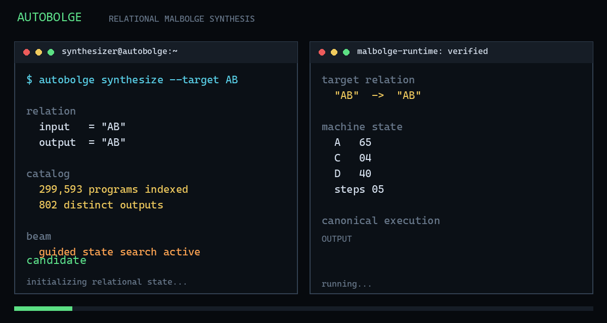

# Autobolge



**Autobolge is an evidence-first relational synthesizer for Malbolge.**

Campaign roadmap: see [ROADMAP.md](ROADMAP.md).

It searches for Malbolge programs from behavioral relations, executes every
candidate through a canonical debugger, and verifies the resulting program
against explicit I/O cases. The project combines exhaustive short-program
catalogs, state-aware beam search, structured family scans, and reproducible
verification artifacts.

---

## Why It Matters

Malbolge is deliberately hostile to ordinary program synthesis: its memory is
self-modifying, instruction decoding depends on program position, and small
source changes can destroy an otherwise useful behavior. Autobolge treats that
behavior as a relational search problem instead of relying on hand-written
programs.

**Key insight:** Existing Malbolge→C translators restore memory to its original
state **after every single instruction**. Autobolge's printer-loop / template
synthesis advances **multiple steps before restoring** — a fundamentally
different approach that enables relational synthesis from behavioral
equivalence classes.

---

## Verified Results

### Catalog & Synthesis (Gate 1 & 2 — PASSED)
- 299,593 valid programs indexed through length 6.
- 802 distinct observed outputs in that catalog.
- Automatic one-character echo synthesis: `ub`.
- Automatic two-character prefix echo synthesis: `ubs``.
- `ubs`` verified for `AB -> AB`, `HI -> HI`, and `XYZ -> XY`.
- Canonical `Hello, world.` execution verified through the real interpreter.
- Structured exploration of the canonical `(=<` Malbolge family.

### Zig Fast Engine — Semantic Parity (Gate 2 — PASSED)
- `zig/bolge.zig` replicates the reference debugger's semantics **exactly**,
  including the `malbolge` package's `SparseMemory` **lazy crazy-fill overlay
  behavior** (the critical quirk: block-tail+1 seeds read from overlay at first
  distant access, so prior encrypts/rotations change the fill).
- Parity gates: 417 randomized cases + all 299,593 catalog entries **identical
  (0 mismatches)**.
- Throughput: ~28× faster on length ≤ 5 (13.9s → 0.5s); len-6 catalog rebuilt
  in ~4 s instead of minutes (Python reference).

### Frontier Scans — Honest Negatives (Gate D1 — PASSED)
Exhaustive negative frontier scans with the Zig motor: `HI` without input is
not found through the complete valid program space at:
- Length 7:   2,097,152 programs  (22.7 s Python → **2.7 s DSL**)
- Length 8:  16,777,216 programs (170.7 s Python → **2.2 min DSL**)
- Length 9: 134,217,728 programs (1,720 s Python → **14.7 min DSL**)
- **Length 10: 1,073,741,824 programs — 2.85 h DSL, 0 hits**  
  Evidence: `experiments/evidence/frontier_HI_len10.json` (sha256 `2a31218d446c224b8a46536af24cff93ef94f2eba5a88e7f8843e17ef7cd2b44`)

Negative results are retained as evidence (`experiments/evidence/frontier_HI_len*.json`)
rather than hidden — the research record includes both constructions and limits.

### Specialized DSL — Zero-Cost Abstraction (Gate D3 — MEASURED)
A minimal search-machine ISA (`.bolge` programs) executed by a Zig runtime
(`bolge-dsl.exe`) with primitives that exist **only for this workload**:
`FRONTIER`, `CATALOG`, `BRANCH`, `ENUMERATE`, `EXECUTE`, `FILTER`, `DEDUP`,
`EMIT`, `HASH`, `TRACE`.

| Workload | Zig Hardcoded | DSL (`bolge-dsl.exe`) | Overhead |
|----------|---------------|----------------------|----------|
| len-8 (16.7M) | 134.6 s @ 124,651 p/s | 134.7 s @ 124,569 p/s | **0.07%** |
| Peak Memory | 6.0 MB | 4.1 MB | — |

The DSL adds **programmability at ~0 cost** because each primitive maps 1:1
to a native runtime operation; there is no general-purpose interpreter layer.

### Solver Campaigns — Hybrid Generator + Dataflow (H3/H4 — MEASURED)
The quine-research solver (`quine_research/search_quine_malbolge/`) generates
Malbolge programs for target outputs via the `malbolge` package translator,
batch-verified through the Zig VM.

- **H3 cross-target memoization** — split verdict. H3a SUPPORTED: shared
  structure exists (12.9% cache hits, −15% evaluations over 676 ABC targets).
  H3b FALSIFIED: wall-clock unchanged (83.1 s vs baseline band 79.3–83.7 s);
  per-node cost rose ~23% from dict/hash overhead. Kept as an opt-in
  `shared_state_cache` hook.
- **H4 parallelization by target** — SUPPORTED. With `random_seed=42` now
  actually passed through (it was silently dropped before), generation is
  fully deterministic: identical 2,730,128 nodes and byte-identical programs
  across serial and all worker counts. 676/676 matched, 0 mismatched.

| Workers | Generation | Targets/s | Peak worker RSS |
|---------|-----------|-----------|-----------------|
| 1 (serial) | 76.3 s | 8.9 | — |
| 2 | 44.6 s | 15.2 | 95 MB |
| 4 | 23.8 s | 28.4 | 161 MB |
| 6 | 18.0 s | 37.5 | 226 MB |
| 8 | 14.7 s | 45.9 | 294 MB |

Evidence: `quine_research/search_quine_malbolge/results/h4_sweep.json` plus
per-config banks (`program_bank_ABC_zig*.json`).

### Dataflow Orchestrator (`quine_research/dataflow/`)
Autobolge is no longer a single search: nodes are typed contracts
(`SearchResult → ClassifierResult → SelectionResult → TransformResult →
SolverResult → CompareResult → Verdict`), each persisted as an explicit
`runs/<pipeline>/<stage>__<hash>/artifact.json`. Node identity is
`sha256(params + upstream artifact hashes)` — unchanged nodes SKIP, changed
params invalidate only downstream (no accidental 200M-program reruns).
Executors are routed per node (`frontier` → Zig batch, the rest → Python),
crossing the language boundary per batch, never per candidate. The lens
template (`frontier_campaign.template.json`) uses **logical coordinates**
(`L1/L2/L3` via `--var`, non-consecutive allowed), so assemblies rebase
(2,3,4) → (3,4,5) and share artifacts by hash. Verified end-to-end:
assembly B ran an exhaustive physical length-3 frontier (830,584 candidates
in 6.7 s), solver 4/4 matched, all gates PASS.

First roadmap campaigns executed on it (see ROADMAP.md):
- **Multi-char synthesis**: 14 targets of 3–9 chars ("HI!" … "AUTOBOLGE"),
  14/14 matched and Zig-verified.
- **Busy Beaver**: exhaustive len 1–3 champions (all-NUL at len ≤ 3:
  `'c'`/`'cb'`/`'cba'`; non-NUL at len 3: `'ba` → `'\r\r'`, `'>ba'` → `'ss'`).

---

## Quick Start

```bash
# Python demo (relational synthesis, beam search, catalog)
pip install malbolge pillow
python experiments/relational_synthesis_demo.py

# Zig fast engine (batch runner, verified parity)
cd zig
..\zig.exe build-exe bolge.zig -O ReleaseFast "-femit-bin=bolge.exe"
.\bolge.exe in.bin out.bin 3000

# Specialized DSL (production frontier scans)
..\zig.exe build-exe dsl.zig -O ReleaseFast "-femit-bin=bolge-dsl.exe"
.\bolge-dsl.exe ..\experiments\frontier_HI_len10.bolge

# Bounded multi-case input relation: one source must satisfy every CASE.
.\bolge-dsl.exe ..\experiments\dsl_maldoom_input_branch_smoke.bolge
```

The demo loads the persisted catalog under `experiments/catalog_cache/`, runs
exact and guided synthesis, verifies the generated programs, and checks the
canonical Hello World program.

---

## Architecture

```
┌─────────────────────────────────────────────────────────────────┐
│                      SEARCH MACHINE ISA                         │
│  .bolge programs: FRONTIER, CATALOG, ENUMERATE, EXECUTE, ...   │
└────────────────────────────┬────────────────────────────────────┘
                             │
                             ▼
┌─────────────────────────────────────────────────────────────────┐
│                    ZIG RUNTIME (bolge-dsl.exe)                  │
│  ┌──────────────┐  ┌──────────────┐  ┌──────────────┐           │
│  │ ENUMERATE    │  │ EXECUTE      │  │ EMIT + HASH  │           │
│  │ mixed-radix  │──▶│ vm.runProgram│──▶│ JSON + sha256│           │
│  │ valid chars  │  │ (in-process) │  │ evidence     │           │
│  └──────────────┘  └──────────────┘  └──────────────┘           │
└────────────────────────────┬────────────────────────────────────┘
                             │
                             ▼
┌─────────────────────────────────────────────────────────────────┐
│                      SHARED VM (vm.zig)                         │
│  • Crazy table (trit-wise, base-3)                              │
│  • Rotate (×19683 mod 59049)                                    │
│  • Lazy crazy-fill overlay (block=243, seed=tail+1 from overlay)│
│  • Encrypt post-step (guarded 33..126)                          │
│  • Step counter = ALL steps including terminating               │
└────────────────────────────┬────────────────────────────────────┘
                             │
              ┌──────────────┼──────────────┐
              ▼              ▼              ▼
       bolge.exe         bolge-dsl.exe   printer_loop.py
       (batch CLI)       (DSL runtime)   (oracle gate)
```

### Module Map

| Module | Purpose |
| --- | --- |
| `zig/vm.zig` | **Single source of truth** for Malbolge semantics (lazy fill, encrypt, rotate) |
| `zig/bolge.zig` | Batch CLI (`in.bin` → `out.bin`), imports `vm.zig` |
| `zig/dsl.zig` | Search-machine ISA runtime (`.bolge` parser + executor) |
| `zig/frontier_scan.zig` | Hardcoded baseline for benchmarking |
| `relational/materialization.py` | Catalogs, family scans, beam synthesis (engine param = "fast"|"reference") |
| `relational/fast_engine.py` | Python wrapper → `bolge.exe` batch protocol |
| `experiments/printer_loop.py` | Gate 2: recompiles `bolge.exe`, runs 299,593 molds, 0 mismatches |
| `experiments/gate1_parity.py` | Gate 1: 417 randomized cases vs `run_bounded` |
| `experiments/*.bolge` | DSL programs (declarative search specs) |
| `quine_research/dataflow/` | Dataflow orchestrator: contract nodes, hash-keyed artifacts, no-rerun, per-node executors (Zig/Python), lens template |
| `quine_research/search_quine_malbolge/` | Hybrid solver (translator generator + Zig batch verification), `--workers N` parallel generation |

---

## Evidence Policy

Every reported program is re-executed before it is called successful. Reports
include exact outputs, step counts, stop reasons, and program SHA-256 hashes.
The project reports both successful constructions and search limits.

Key evidence files:
- `experiments/evidence/gate1_parity.json` — 417/417 parity
- `experiments/evidence/gate2_catalog.json` — full catalog rebuild
- `experiments/evidence/printer_loop.json` — mold-by-mold verification
- `experiments/evidence/frontier_HI_len{7,8,9,10}.json` — negative frontiers
- `experiments/evidence/dsl_frontier_HI_len7.json` — DSL len-7 reproduction
- `experiments/evidence/dsl_catalog_len6.json` — DSL catalog (299,593 entries, 0 mismatches vs reference)
- `experiments/evidence/bench_hardcoded_len8.json` / `bench_dsl_len8.json` — D3 benchmark

---

## Reproducing Gates

```bash
# Gate 1: randomized parity (417 cases)
python experiments/gate1_parity.py

# Gate 2: catalog parity + printer loop (299,593 entries)
python experiments/printer_loop.py

# Gate D1: DSL len-7 frontier reproduction
cd zig && ..\zig.exe build-exe dsl.zig -O ReleaseFast "-femit-bin=bolge-dsl.exe"
.\bolge-dsl.exe ..\experiments\dsl_gate_d1_len7.bolge

# Gate D2: DSL catalog len-6 (full entry-by-entry parity)
.\bolge-dsl.exe ..\experiments\dsl_gate_d2_catalog.bolge
python -c "
import json
ref = json.load(open('experiments/catalog_cache/catalog_e6dfb345.json', encoding='utf-8'))
dsl = json.load(open('experiments/evidence/dsl_catalog_len6.json', encoding='utf-8'))['entries']
assert all(all(a[f]==b[f] for f in ('program','output','steps','terminated','stop_reason','final_a','final_pc','final_d')) for a,b in zip(ref,dsl))
print('D2 PASSED: 0/299593 mismatches')
"

# Gate D3: benchmark (Zig hardcoded vs DSL)
# (run both, compare rates + peak memory)
```

---

## Status

**Research prototype — gates passing, frontier open.**

| Component | Status |
| --- | --- |
| Short-program synthesizer | ✅ Working |
| Verification pipeline | ✅ Gates 1, 2, D1, D2, D3 passed |
| Zig fast engine (bolge.exe) | ✅ 0 mismatches, ~28× speedup |
| Specialized DSL (bolge-dsl.exe) | ✅ Zero-cost abstraction measured |
| Streaming continuity prototype | ✅ `Hi` composed from two continuations into one program in the toolkit interpreter |
| `FRONTIER PREFIX_FILE` | ✅ Searches position-correct suffixes after a fixed Classic seed |
| Bounded multi-case `BRANCH` relation | 🔬 MALDOOM V1 primitive search; echo alone does not prove an internal control branch |
| Ternary sequence `012 -> 120` | ❌ No hit in the length-3 bounded frontier |
| Frontier `HI` (len ≤ 9) | ✅ Exhaustively negative |
| **Frontier `HI` (len 10)** | ✅ **Completed: 1.07B programs, 2.85 h, 0 hits** |
| Multi-character output synthesis | 🔬 Open (next: template composition from len-10 negatives) |
| E33 Busy Beaver verification | ⏳ Pending (champion S(4)=107) |

## Continuation Claim Boundary

`malbolge_translator/streaming.py` keeps a toolkit snapshot while synthesizing
small fixed-text continuations, then verifies the resulting single Classic
program from bootstrap. It does **not** serialize state for a fresh VM.

`FRONTIER ... PREFIX_FILE <path>` evaluates suffixes after a fixed seed with
correct positional opcode encoding. The `truth_machine.mal` probe established
that its halt branch exits before appended code; it is not a usable continuation
anchor. Fresh-VM resume, independent-runtime parity for a continuation, and
full Don Quixote generation remain `NOT_DEMONSTRATED`.

---

## License

MIT. See `LICENSE` when present.
