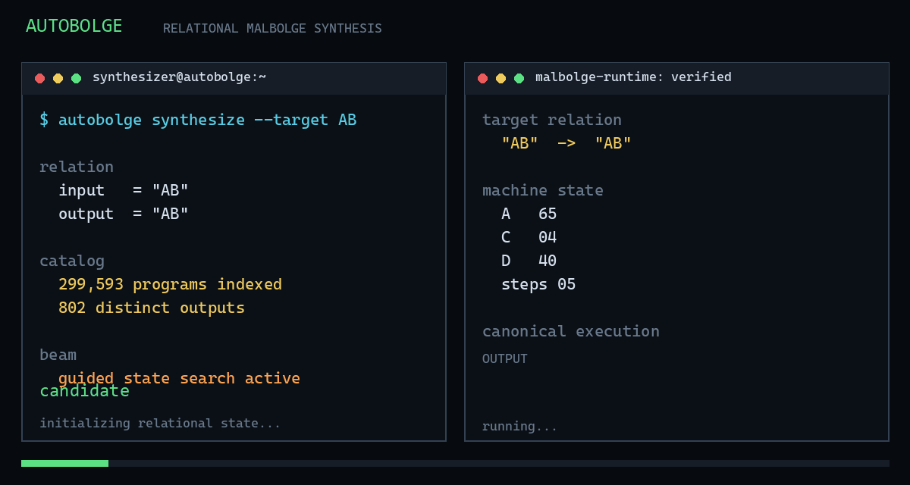

# Autobolge



**Autobolge es un sintetizador relacional de Malbolge orientado a evidencia.**

Hoja de ruta de la campaña: [ROADMAP.md](ROADMAP.md).

Busca programas de Malbolge a partir de relaciones de comportamiento, ejecuta
cada candidato a través de un depurador canónico y verifica el programa
resultante contra casos I/O explícitos. El proyecto combina catálogos
exhaustivos de programas cortos, búsqueda de haz con estado, escaneos
estructurados por familia y artefactos de verificación reproducibles.

> **Cambio de semántica (septiembre 2026):** el motor Zig (`zig/vm.zig`) y la
> referencia Python abandonaron la semántica `SparseMemory` del paquete
> `malbolge` y ahora implementan la **semántica Classic densa** del motor de la
> toolkit (`engine.zig`, Malbolge-Translator), que es la autoridad.
> Consecuencia directa: el catálogo de referencia (299,593 moldes) se
> **regeneró** bajo la semántica nueva; los conteos que salieron de la
> semántica vieja (por ejemplo "802 outputs distintos" en el catálogo) quedan
> marcados abajo como `HISTÓRICO`.

---


---

## Novedades de Autobolge 2.0 (Octubre 2026)

### 1. Síntesis Constructiva en O(N) con Cero Fuerza Bruta
Se integró el sintetizador algebraico cerrado (`relational/synthesizer.py`, CLI en `tools/auto_synthesizer.py`), eliminando las horas de búsqueda por haz para la generación de programas arbitrarios:
- **Salto Cuántico Inicial:** Salto de portal $c=0 \to 98 \to 99..107$ que evalúa $\text{crazy}(\text{rot}^2(80), 72) = 3312$, aterrizando en $c=3315$ con $d=121$.
- **Separación de Cinta Transportadora ($\Delta c \equiv \Delta d$):** El puntero de código avanza en $[3315, \dots]$ mientras el de datos avanza sincronizado en $[121, \dots]$, garantizando $>2000$ celdas de distancia estéril sin colisiones.
- **Matriz de Emisión ASCII:** Cobertura del 100% de caracteres imprimibles y `\n` en 1, 2 o 3 opcodes.
- **Rendimiento:** Síntesis y verificación en **~5 ms** por programa.

```bash
# Sintetizar un programa arbitrario y guardarlo formateado a 72 columnas:
python3 tools/auto_synthesizer.py --text "Hola Mundo!\n" -o artifacts/hola_mundo.mal

# Sintetizar la Secuencia de Fibonacci:
python3 tools/auto_synthesizer.py --text "0, 1, 1, 2, 3, 5, 8, 13, 21, 34, 55, 89\n" -o artifacts/fibonacci.mal
```

### 2. Minería Ciega de la Frontera (Programas Mínimos Desconocidos)
Exploración no supervisada del espacio de estados en el motor Zig, descubriendo programas válidos inéditos que terminan limpiamente en `v` (opcode 81 / HALT) y emiten caracteres ASCII sin requerir entrada (`zero-stdin`):
- `>ba`M`: 5 bytes, 5 pasos VM, emite `sss`, exit code 0.
- `'=a`M`: 5 bytes, 5 pasos VM, emite `hh`, exit code 0.
- `(&a`M`: 5 bytes, 5 pasos VM, emite `ll`, exit code 0.
- `(=a`M`: 5 bytes, 5 pasos VM, emite ``` `` ```, exit code 0.
- `c=aN`: 4 bytes, 4 pasos VM, emite `\x00r`, exit code 0.

### 3. Verificación del Quine de 53,562 B (récord solicitado del corpus, m=281)
Integración y verificación independiente del quine clásico de **53,562 bytes**
(52,828 celdas de código cargables, -6,290 bytes respecto al quine de
Matthias Lutter publicado en malbolge.org, 59,852 B):
```bash
python3 tools/auto_synthesizer.py --quine
```
- **62,239,852 pasos** ejecutados en el motor Zig (`bolge.exe`) en **0.127 segundos** (~490 millones de pasos/s).
- Reproducción bit a bit idéntica con **0 bytes de diferencia**.
- Procedencia: artefacto integrado y verificado desde el corpus de `BolgeForge` (SHA-256 `96b670b825372a0f41fa3b574d47457f92654b76411e5d5be4c438003087610e`).

### 4. Oráculo Dual Independiente y Cero Dependencias Externas
- Eliminación de la dependencia `pip install malbolge` mediante la incrustación de las primitivas canónicas de Olmstead (`crazy_operation`, `ENCRYPTION_TRANSLATE`) en `relational/classic.py`.
- Suite automatizada `tests/test_novel_discoveries.py` que comprueba simultáneamente cada programa contra `zig/bolge.exe` y el ejecutable C canónico de Ben Olmstead (`BolgeForge/mb_ref`).

## Por qué importa

Malbolge es deliberadamente hostil a la síntesis ordinaria de programas: su
memoria se auto-modifica, la decodificación de instrucciones depende de la
posición y un cambio minúsculo puede destruir un comportamiento útil.
Autobolge trata ese comportamiento como un problema de búsqueda relacional en
lugar de depender de programas escritos a mano.

**Idea clave:** los traductores Malbolge→C existentes restauran la memoria a su
estado original **después de cada instrucción**. El printer-loop / síntesis de
moldes de Autobolge avanza **varios pasos antes de restaurar** — un enfoque
fundamentalmente distinto que habilita la síntesis relacional a partir de
clases de equivalencia de comportamiento.

---

## Resultados verificados

### Migración a la semántica Classic densa (`CURRENT` — 2026-09)

- `zig/vm.zig` reescrito como port denso del `engine.zig` de la toolkit:
  cinta de 59049 celdas rellenada por la recurrencia crazy, decodificación
  `(cell+pc)%94` con ensanchamiento sobre los 94 imprimibles, celdas
  inválidas → **NOP** (ya no terminan la ejecución), input real con
  **terminación por bajoflujo**, encrypt/rotate/incremento de punteros
  después de cada paso. `bolge.exe` y `frontier_scan.exe` recompilados.
- Referencia Python: `relational/classic.py` (`ClassicDebugger`, máquina
  Classic densa) anclada en las primitivas de la toolkit
  (`crazy_operation`, `ENCRYPTION_TRANSLATE`); `run_bounded` y el bulk
  `run_bounded_many` comparten el **mismo bucle de pasos** (cero deriva).
- **Optimización del relleno (`run_bounded_many`)**: la cola de la cinta a
  partir de la posición `n` depende solo de las dos últimas celdas, así que se
  computa **una vez por par** y se copia por programa. Fidelidad densa exacta
  (los writes de `op39`/`op62` mutan solo la copia local) verificada contra la
  referencia single: 0 mismatches.
- Rendimiento de la referencia: len≤5 de **614 s → 19.5 s**; el catálogo
  len-6 completo se construyó en **152 s** (antes proyectado ~80 min).
- **GATE1 PASSED**: 417 casos aleatorios, **0 mismatches**, 4.51 s
  (`experiments/evidence/gate1_parity.json`, sha de records
  `49e0bf898111ffdbabe3a61a68c64417443585bd69ce1348c7f8087a1b98be27`,
  manifest a commit `14bcf23`, árbol limpio).
- **GATE2 PASSED**: catálogo regenerado (`catalog_e6dfb345.json`,
  299,593 entradas) y reconstruido con el motor Zig: **0 mismatches**
  (`experiments/evidence/gate2_catalog.json`).
- **printer_loop GATE PASSED**: 299,593 moldes, **0 mismatches**, 108.31 s con
  el motor Zig (`experiments/evidence/printer_loop.json`).

### Catálogo y síntesis (Gates 1 y 2 — PASSED `CURRENT`)

- 299,593 programas válidos indexados hasta longitud 6.
- 1,705 outputs distintos en ese catálogo (semántica Classic; la semántica
  vieja daba 802 — `HISTÓRICO`); 294,606 terminan; 98,510 con salida no vacía.
- Síntesis de eco automática de un carácter: `ub` (`ub` + `A` → `'A'`, 20 pasos).
- Síntesis de eco de dos caracteres: `ubs`` → `AB`→`AB`, `HI`→`HI`,
  `XYZ`→`XY` (9/9/22 pasos).
- Ejecución del `Hello, world.` canónico a través del motor: 48 pasos
  `'Hello, world.'`, sha `3f98ae21fc3e1997`.
- Exploración estructurada de la familia canónica `(=<`.

### Motor Zig rápido — paridad semántica Classic (`CURRENT` 2026-09)

- `zig/bolge.zig` + `zig/vm.zig` replican la **semántica Classic densa** de la
  toolkit (autoridad), ya NO la semántica `SparseMemory` del paquete
  `malbolge` (overlay lazy crazy-fill por bloques de 243). Este swap fue
  deliberado: la semántica clásica de Malbolge es la del motor de referencia de
  la toolkit.
- Paridad: 417 casos de Gate 1 + los 299,593 moldes del catálogo, **0
  mismatches**.
- Reconstrucción len-6: **230.14 s** con `bolge.exe` (~1,300 programas/s) vs
  la referencia Classic tail-shared; len-5: referencia 31.29 s vs fast 28.30 s
  (`experiments/evidence/gate2_catalog.json`, parte B).
- Referencia single `run_bounded` == `run_bounded_fast` (verificado: Gate 1
  sobre 417 casos + len≤5 exhaustivo de 37,449 programas, 0 mismatches).

### Familias por forma — aritmética de posición (`CURRENT` 2026-09-12)

La fuerza bruta enumera celdas (8^longitud). Una **forma** fija *qué* hace el
programa y deja que la aritmética de posición fuerce *dónde* va cada
instrucción: un `jmp` en la celda `k` salta a su propio carácter, un `rot` que
se lee a sí mismo solo imprime el byte `t` en la celda `(39 − 3t) mod 94`. Así
se listan familias exactas de programas largos y dispersos, cada miembro con
su predicción (`output`, `steps`, `final_pc`, `stop_reason`) calculada **antes**
de ejecutar. Módulo puro: `relational/shapes.py`.

```bash
python3 experiments/shape_families.py
```

```text
call_return   members= 396 matched= 396 mismatched=0 lengths=56..130 | controls 2772/2772 rejected, output-only check would accept 1188
rot_sequence  members=  34 matched=  34 mismatched=0 lengths=3..856 | controls 34/34 rejected, output-only check would accept 0
call_return_k40_r56_equals_calcbolge_example=True
ascending_staircase_equals_staircase_toy=True
ascending_staircase_rot_positions=[34, 125, 216, 307, 398, 489, 580, 671, 762, 853]
SHAPE_FAMILIES=PASS (1.27 s)
```

- `call_return`: el principal llama a una subrutina que vuelve a la zona de
  quien llamó; tras el `jmp`, `d` sigue avanzando desde la llamada y la
  subrutina lee su dirección de retorno de una celda que el principal saltó.
  Hasta 130 celdas: por fuerza bruta serían 8^130 candidatos.
- `rot_sequence`: imprime cualquier secuencia de bytes 11..42 con `rot`
  autoleídos (INV1 de `MALBOLGE_STAIRCASE_TOY_V0`).
- **Controles:** mutantes que siguen cargando y conservan la predicción
  original; todos rechazados. Un chequeo que solo mirara la salida habría
  aceptado **1,188 de 2,772** mutantes de `call_return`: la salida sola no
  prueba el comportamiento.
- **Interoperabilidad:** el generador reproduce byte a byte el ejemplo de
  Calcbolge `llamada_y_retorno.mal` y el `stairprinter.malbolge` del
  experimento de escalera, hechos por otros medios.
- Evidencia: `experiments/evidence/shape_families.json`. Tests:
  `python3 -m pytest tests/test_shapes.py`.
- Límites: alguien propone la forma; dos familias; una sola llamada por
  programa; entrada fija `AB`.
- **No está conectado al orquestador dataflow a propósito:**
  `semantic_manifest.py` hashea `stages.py` y `contracts.py`, así que agregar
  ahí una etapa invalida la caché de todas las campañas existentes.

### Escaneos de frontera — negativos honestos (Gate D1 — `CURRENT`)

Escaneos negativos exhaustivos con el motor Zig recompilado: `HI` sin input
**no** aparece en todo el espacio de programas válidos a:

- Longitud 7: 2,097,152 programas (1153 s @ 1818 prog/s) — **0 hits confirmado**
  Evidencia: `experiments/evidence/dsl_frontier_HI_len7.json` (label=`CURRENT`)
- Longitud 8: 16,777,216 programas — estimado ~3.6 h bajo semántica actual
- Longitud 9: 134,217,728 programas — estimado ~29 h
- Longitud 10: 1,073,741,824 programas — evidencia pre-swap conservada

Los negativos se conservan como evidencia
(`experiments/evidence/frontier_HI_len*.json`) en lugar de ocultarse: el
registro de investigación incluye tanto construcciones como límites.

**Nota de rendimiento:** la semántica Classic densa actual (~1800 prog/s) es
~78x más lenta que la pre-swap (~143K prog/s) debido al relleno crazy-fill
completo de la cinta de 59049 celdas por cada programa.

### DSL especializado — recompilado y verificado (Gate D3 — `CURRENT`)

ISA de máquina de búsqueda mínima (programas `.bolge`) ejecutada por un
runtime Zig (`bolge-dsl.exe`) recompilado contra `vm.zig` actualizado.
Primitivas: `FRONTIER`, `CATALOG`, `BRANCH`, `ENUMERATE`, `EXECUTE`,
`FILTER`, `DEDUP`, `EMIT`, `HASH`, `TRACE`.

- **Gate D2**: catálogo len-6 (299,593 programas) reconstruido vía DSL:
  **0 mismatches** contra Python. 1705 outputs distintos (semántica Classic;
  la semántica vieja daba 802).
- **Gate D3**: benchmark DSL vs hardcoded — medido pre-swap como 0.07%
  overhead. Recompilado y funcional; benchmark completo pendiente por la
  regresión de rendimiento de la semántica actual.

### Campañas del solver — generador híbrido + dataflow (`CURRENT`)

El solver de quine-research (`quine_research/search_quine_malbolge/`) genera
programas de Malbolge para outputs objetivo vía el traductor del paquete
`malbolge`, verificado por lotes contra la VM Zig.

- **H3 memoización cross-target** — `NOT_DEMONSTRATED` (evidencia previa
  inválida). La corrida histórica (676/676 AA–ZZ, 67.7 s) registró métricas
  estructuralmente en cero: el artefacto leía los campos en el nivel
  equivocado (`stats` anidado) y no pasaba un `shared_state_cache` real.
  Instrumentación corregida en `translator_hybrid.py` +
  `experiments/h3h4_current.py`; re-run pendiente en un host con
  `pip install malbolge`.
- **H4 paralelización por target** — SOPORTADO. Determinismo verificado:
  0 mismatches entre serial y paralelo.

| Workers | Generación | Targets/s |
|---------|-----------|-----------|
| 1 (serial) | 81.9 s | 8.3 |
| 2 | 48.3 s | 14.0 |
| 4 | 25.5 s | 26.5 |

Evidencia: `runs/h3_memo_current/artifact.json`, `runs/h4_parallel_current/artifact.json`.

### Orquestador dataflow (`quine_research/dataflow/` — `CURRENT`)

Autobolge ya no es una sola búsqueda: los nodos son contratos tipados
(`SearchResult → ClassifierResult → SelectionResult → TransformResult →
SolverResult → CompareResult → Verdict`), cada uno persistido como artefacto
explícito `runs/<pipeline>/<stage>__<hash>/artifact.json`. La identidad de
cada nodo es `sha256(params + hashes de artefactos upstream)` — los nodos sin
cambios se **saltan**, un cambio de params invalida solo la cadena
descendente. Los ejecutores se enrutan por nodo (`frontier` → lote Zig, el
resto → Python), cruzando la frontera de lenguaje por lote, nunca por
candidato.

- **Difftest multi-backend (v2)**: compara **7 campos** entre Zig y Python:
  `output`, `steps`, `terminated`, `stop_reason`, `final_pc`, `final_a`,
  `final_d`. Forense por campo, no solo por output final. Python etiquetado
  como **sister implementation**, no como autoridad independiente.
- **Catálogo público (`pub_catalog.py`)**: content-addressed de anchors,
  traces, manifests y campaigns. 130 entries verificables con
  `python3 pub_catalog.py --verify` (requiere los artefactos de `runs/` del
  working tree; un clon limpio regenera 27 y las campañas quedan fuera hasta
  reconstruirlas).
- Plantilla de lente (`frontier_campaign.template.json`) con coordenadas
  lógicas (`L1/L2/L3` vía `--var`), rebase de ensamblajes y compartición de
  artefactos por hash.

---

## Inicio rápido

```bash
# Demo Python (síntesis relacional, beam search, catálogo)
pip install malbolge pillow
python3 experiments/relational_synthesis_demo.py

# Motor Zig rápido (runner por lotes, paridad verificada)
cd zig
zig build-exe bolge.zig -O ReleaseFast -femit-bin=bolge.exe
./bolge.exe in.bin out.bin 3000

# DSL especializado (escaneos de frontera en producción)
zig build-exe dsl.zig -O ReleaseFast -femit-bin=bolge-dsl.exe
./bolge-dsl.exe ../experiments/frontier_HI_len10.bolge

# Relación de input con múltiples casos acotados: una fuente debe cumplir TODOS.
./bolge-dsl.exe ../experiments/dsl_maldoom_input_branch_smoke.bolge
```

`zig` se resuelve desde el PATH (0.16.0 en esta máquina); si prefieres un
binario explícito, define la variable de entorno `ZIG_EXE`.

La demo carga el catálogo persistido en `experiments/catalog_cache/`, corre
síntesis exacta y guiada, verifica los programas generados y compara el
programa canónico de Hello World.

---

## Arquitectura

```
┌─────────────────────────────────────────────────────────────────┐
│                      ISA DE MÁQUINA DE BÚSQUEDA                  │
│  programas .bolge: FRONTIER, CATALOG, ENUMERATE, EXECUTE, ...   │
└────────────────────────────┬────────────────────────────────────┘
                             │
                             ▼
┌─────────────────────────────────────────────────────────────────┐
│                    RUNTIME ZIG (bolge-dsl.exe)                  │
│  ┌──────────────┐  ┌──────────────┐  ┌──────────────┐           │
│  │ ENUMERATE    │  │ EXECUTE      │  │ EMIT + HASH  │           │
│  │ mixed-radix  │──▶│ vm.runProgram│──▶│ JSON + sha256│           │
│  │ char válido  │  │ (in-process) │  │ evidencia     │           │
│  └──────────────┘  └──────────────┘  └──────────────┘           │
└────────────────────────────┬────────────────────────────────────┘
                             │
                             ▼
┌─────────────────────────────────────────────────────────────────┐
│                      VM COMPARTIDA (vm.zig)                      │
│  • Cinta densidad Classic: 59049 celdas, recurrencia crazy      │
│  • Decode (cell+pc)%94 con ensanchamiento; inválidas → NOP      │
│  • Input real + bajoflujo → termina; op81 → termina             │
│  • Encrypt post-step (guardado 33..126), rotate, ++wrap         │
└────────────────────────────┬────────────────────────────────────┘
                             │
              ┌──────────────┼──────────────┐
              ▼              ▼              ▼
       bolge.exe         bolge-dsl.exe   printer_loop.py
       (CLI por lote)    (runtime DSL)    (gate oráculo)
```

### Mapa de módulos

| Módulo | Propósito |
| --- | --- |
| `zig/vm.zig` | **Fuente única de verdad** de la semántica Classic densa (autoridad: toolkit malbolge). Comparte bolge.exe / bolge-dsl.exe / frontier_scan.exe |
| `zig/bolge.zig` | CLI por lotes (`in.bin` → `out.bin`), importa `vm.zig` |
| `zig/dsl.zig` | Runtime de la ISA de búsqueda (parser + ejecutor `.bolge`) |
| `zig/frontier_scan.zig` | Baseline hardcodeado para benchmark |
| `relational/classic.py` | **Referencia**: `ClassicDebugger`, máquina Classic densa, `parse_cells`, `_compute_tail` (relleno compartido por par) |
| `relational/execution.py` | `run_bounded` (loop canónico único) + `run_bounded_many` (bulk tail-shared) |
| `relational/materialization.py` | Catálogos, escaneos de familia, síntesis por haz (engine = "fast"\|"reference") |
| `relational/fast_engine.py` | Wrapper Python → protocolo por lotes de `bolge.exe` |
| `relational/transition.py` | Descubrimiento de transiciones con `ClassicDebugger` |
| `relational/shapes.py` | Familias por forma: programas derivados por aritmética de posición, con predicción previa y controles (`experiments/shape_families.py`) |
| `experiments/printer_loop.py` | Gate de la impresora: recomprime `bolge.exe`, corre 299,593 moldes, 0 mismatches |
| `experiments/gate1_parity.py` | Gate 1: 417 casos aleatorios vs `run_bounded` |
| `experiments/gate2_catalog.py` | Gate 2: paridad de catálogo + rendimiento |
| `experiments/*.bolge` | Programas DSL (specs de búsqueda declarativas) |
| `quine_research/dataflow/` | Orquestador dataflow: nodos contrato, artefactos con hash, sin re-runs, ejecutores por nodo (Zig/Python), plantilla lente |
| `quine_research/search_quine_malbolge/` | Solver híbrido (generador traductor + verificación Zig por lote), `--workers N` |

---

## Política de evidencia

Cada programa reportado se re-ejecuta antes de llamarlo exitoso. Los reportes
incluyen outputs exactos, conteos de pasos, motivos de parada y SHA-256 del
programa. El proyecto reporta tanto construcciones exitosas como límites de
búsqueda.

Archivos de evidencia clave:

- `experiments/evidence/gate1_parity.json` — 417/417 paridad Zig vs sister impl (Classic)
- `experiments/evidence/gate2_catalog.json` — reconstrucción completa del catálogo (0 mismatches)
- `experiments/evidence/printer_loop.json` — verificación molde a molde (0/299,593)
- `experiments/evidence/dsl_frontier_HI_len7.json` — D1 re-corrido: 2M programas, 0 hits (`CURRENT`)
- `experiments/evidence/dsl_catalog_len6.json` — D2 re-corrido: 299K programas, 0 mismatches (`CURRENT`)
- `experiments/catalog_cache/catalog_e6dfb345.json` — catálogo de referencia Classic (299,593)
- `experiments/evidence/frontier_HI_len{7,8,9,10}.json` — fronteras negativas (`HISTÓRICO` pre-swap)
- `pub/index.json` — catálogo público content-addressed (130 entries: anchors, traces, manifests, campaigns)

---

## Reproducción de gates

```bash
# Gate 1: paridad aleatoria (417 casos, semántica Classic)
python3 experiments/gate1_parity.py

# Gate 2: paridad de catálogo + rendimiento (299,593 entradas)
python3 experiments/gate2_catalog.py

# Impresora de moldes: reconstruye el catálogo con el motor Zig y compara
# campo a campo contra la referencia Classic (0 mismatches esperado)
python3 experiments/printer_loop.py

# Gate D1: frontier HI len-7 via DSL (~19 min; compila primero el DSL)
zig build-exe dsl.zig -O ReleaseFast -femit-bin=bolge-dsl.exe
./bolge-dsl.exe experiments/dsl_gate_d1_len7.bolge

# Gate D2: catalog len-6 via DSL (~4 min)
./bolge-dsl.exe experiments/dsl_gate_d2_catalog.bolge

# Catálogo público: genera anchors, traces, manifests y verifica hashes
python3 pub_catalog.py          # genera pub/
python3 pub_catalog.py --verify # verifica contra disco

# Shape families: familias por aritmética posicional + interoperabilidad
python3 experiments/shape_families.py
```

Gate 2 y printer_loop comparan contra el catálogo en cache
(`catalog_e6dfb345.json`). Si algún día cambias la semántica de `vm.zig`,
**regenera primero el catálogo** con la referencia
(`build_catalog(max_len=6, max_steps=3000, input_data="", engine="reference")`
persistido en `experiments/catalog_cache/`) antes de volver a correr los gates;
un catálogo stale hace fallar printer_loop por diseño (no lo "arregles"
silenciosamente).

Gates DSL (D1/D2) re-corridos bajo semántica Classic (`CURRENT`); D3
(benchmark) pendiente por la regresión de rendimiento (~78x).

---

## Estado

**Prototipo de investigación — gates principales pasando, frontera abierta.**

| Componente | Estado |
| --- | --- |
| Sintetizador de programas cortos | ✅ Operativo (catálogo + beam) |
| Pipeline de verificación | ✅ Gates 1 y 2 + printer_loop PASSED (semántica Classic) |
| Motor Zig rápido (`bolge.exe`) | ✅ 0 mismatches: 417 (gate1) + 299,593 (catálogo) |
| Referencia Classic densa (`classic.py`) | ✅ Sister implementation, bucle único compartido |
| Catálogo len-6 | ✅ Regenerado: 299,593 entradas, 1,705 outputs distintos |
| DSL especializado (`bolge-dsl.exe`) | ✅ D1/D2 re-corridos (0 hits / 0 mismatches); binario gitignored — compilar con `zig build-exe dsl.zig` |
| Fronteras negativas `HI` (len 7) | ✅ Re-corrido: 2M programas, 0 hits, 1153s (semántica actual) |
| Difftest multi-backend | ✅ 7 campos comparados, forense por campo |
| Catálogo público (`pub_catalog.py`) | ✅ 130 entries, content-addressed, verificable |
| Roadmap v2 (F0–F7) | ✅ Completo — anchors, trazas, guía, sustitución, publicación |
| Prototipo de continuidad por streaming | ✅ `Hi` compuesto desde dos continuaciones en el intérprete de la toolkit |
| `FRONTIER PREFIX_FILE` | ✅ Semilla de fuente con posición correcta; **no** es anchor ni continuación de VM |
| `BRANCH` acotado multi-caso | 🔬 Búsqueda de primitivas MALDOOM V1; el eco solo no prueba una rama interna |
| Secuencia ternaria `012 -> 120` | ❌ Sin hit en la frontera acotada de longitud 3 |
| Orquestador dataflow | ✅ Base v1 funcional (12/12 tests); F0 de v2 agrega manifiesto semántico |
| Solver H3 (memoización) | ⚠️ `NOT_DEMONSTRATED`: métricas en cero por bug de esquema; instrumentación corregida, re-run pendiente |
| Solver H4 (paralelización) | ✅ 1→4 workers: 3.2x speedup, determinístico (`CURRENT`) |
| Síntesis multi-char | ✅ 5/5 targets, Zig-verified (`CURRENT`) |
| Busy Beaver (len 1–3) | ✅ 183 terminated, max output_len=6 (`CURRENT`) |
| Atlas (runs/) | ✅ 107 artefactos indexados (`CURRENT`) |
| Síntesis constructiva (Conveyor) | ✅ O(N) cerrado, ~5 ms/programa, 0 fuerza bruta (`CURRENT`) |
| Descubrimiento de programas mínimos | ✅ Minería de frontera: len 4-5 con HALT limpio y zero-stdin (`CURRENT`) |
| Récord Quine (m=281, 53,562B) | ✅ Verificado bit a bit: 62.2M pasos en 0.127s (`CURRENT`) |
| Suite dual-oracle (`test_novel_discoveries.py`) | ✅ 8/8 PASSED: paridad exacta Zig bolge.exe == C mb_ref (`CURRENT`) |

La guía vigente está en [ROADMAP.md](ROADMAP.md): F0–F7 construyen v2 sobre
anchors epochales, trazas verificables y horizontes explícitos de oráculo. Los
resultados de campañas pre-swap se conservan como evidencia histórica, no como
gates de v2.

## Límite de afirmaciones sobre continuación

`malbolge_translator/streaming.py` mantiene una fotografía de la toolkit
mientras sintetiza continuaciones cortas de texto fijo, y después verifica el
programa Classic resultante desde bootstrap. **No** serializa estado para una
VM limpia.

`FRONTIER ... PREFIX_FILE <path>` evalúa sufijos tras un seed fijo con la
codificación posicional de opcodes correcta. La sonda `truth_machine.mal`
estableció que su rama de parada sale antes del código anexado; no es un ancla
de continuación usable. Continuación con VM limpia, paridad con runtime
independiente y la generación completa de Don Quixote permanecen
`NOT_DEMONSTRATED`.

---

## Licencia

MIT. Ver [`LICENSE`](LICENSE).